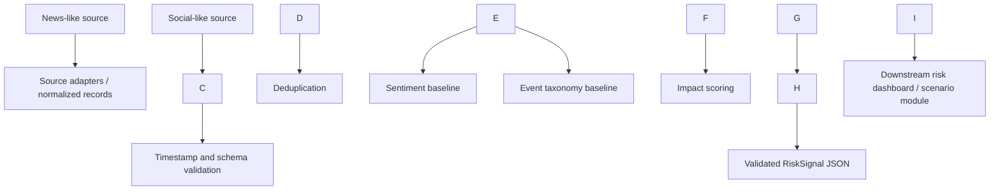

# AI/NLP Risk Engine

An explainable prototype that normalizes financial text from multiple source types and emits structured risk signals for downstream analysis. The repository currently includes a deterministic, rule-based baseline and synthetic replay fixtures so the end-to-end path can be tested without API credentials.

> \*\*Prototype limitation:\*\* sentiment and event classification are phrase/keyword heuristics, not a trained financial NLP model. Impact is an expert-weighted heuristic, not a learned or empirically validated prediction. Confidence fields are heuristic indicators, not calibrated probabilities. Do not use for trading or investment decisions.

## Problem and approach

Unstructured financial text is difficult to compare across channels. This prototype standardizes records, retains source traceability, derives a sentiment score, assigns an event taxonomy, estimates impact using documented components, validates the output contract, and emits JSON for a downstream module.

## Architecture



## Repository layout

* `risk\_engine/schema.py`: validated normalized-input and risk-output contracts.
* `risk\_engine/analyzer.py`: deterministic sentiment/event baseline and risk-signal assembly.
* `risk\_engine/scoring.py`: documented weighted impact formula.
* `risk\_engine/pipeline.py`: JSON/JSONL loading, normalization and deduplication.
* `risk\_engine/storage.py`: SQLite persistence for normalized records and risk signals, with indexed summary queries.
* `persist\_demo.py`: replay the synthetic records and persist records/signals to the local database.
* `data/synthetic/`: invented example records from two simulated source types.
* `data/sample/`: generated JSON outputs.
* `docs/impact\_methodology.md`: weights, interpretation and evaluation requirements.
* `docs/data\_sources.md`: source candidates and data visibility rules.
* `downstream/stress\_test.py`: synthetic portfolio stress scenarios driven by risk signals.
* `run\_demo.py`: end-to-end synthetic replay and downstream stress-test run.
* `source\_adapters/gdelt.py`: live GDELT DOC API headline adapter.
* `source\_adapters/csv\_text.py`: adapter for a local financial/social-text CSV.
* `fetch\_gdelt.py` / `analyze\_csv.py`: source ingestion entry points.
* `tests/`: contract, scoring, classification, deduplication and stress-module tests.

## Quickstart

Requires Python 3.10+; the core engine uses only the Python standard library.

```bash
python -m unittest discover -s tests -v
python run\_engine.py
python run\_demo.py
# Persist records/signals to SQLite and print an impact summary:
python persist\_demo.py
# Optional: choose a different SQLite path
python persist\_demo.py --db data/runtime/my\_risk\_engine.db
# Optional live news ingestion (requires internet access):
python fetch\_gdelt.py --max-records 15 --timespan 1day
# Optional local social/financial CSV (supply the actual column names):
python analyze\_csv.py path/to/your\_dataset.csv --text-column text --timestamp-column created\_at --id-column id --ticker-column ticker
```

To use another input file:

```bash
python run\_engine.py --input path/to/records.json --output data/sample/my\_signals.json
```

Input must be a JSON array or JSONL file. Each record requires `record\_id`, `source`, `published\_at` (ISO-8601), and `text`. Optional fields: `source\_id`, `source\_url`, `metadata`.

### Interactive dashboard

Install the dashboard dependencies and launch the Streamlit interface:

```bash

python -m pip install -r requirements.txt

python -m streamlit run app.py

```


The dashboard supports interactive headline analysis, RiskSignal JSON export, synthetic portfolio stress testing, and inspection of bundled sample signals.


The current analyzer uses deterministic keyword and phrase rules. Impact scores and portfolio shocks are illustrative heuristics, not calibrated financial predictions.

## Output contract

Each signal includes a stable signal ID, input record ID, timestamp, source traceability, heuristic entities, sentiment (`score` in \[-1,1]), controlled event type, impact (`score` 1–10), component breakdown, weights, and evidence/limitations.

## Database

The prototype uses SQLite through Python’s standard library, so no database server or credentials are needed for the local demo. The default database is created at `data/runtime/risk\_engine.db` (ignored by Git). It stores normalized source records and their generated risk signals, with foreign-key traceability and indexes for source, event type, impact and timestamp. Run `python persist\_demo.py` to initialize and populate it. This local SQLite connection is the first persistence layer; a hosted PostgreSQL/Supabase connection can be added later if remote multi-user access is required.

## Dataset and licensing

Bundled demo records are synthetic and clearly labelled. A GDELT DOC API headline adapter and configurable local CSV adapter are included. The default replay still uses synthetic records so tests and the demo remain deterministic. See [`docs/data\_sources.md`](docs/data_sources.md) before downloading or committing external data. Online availability does not imply redistribution permission. Never commit API keys; `.env.example` contains placeholders only.

## Evaluation and results

The current automated tests check expected behavior on controlled fixtures and invalid inputs; they do not establish real-world model accuracy. Do not present synthetic-fixture test success as model performance. Before making quality claims, evaluate on a separate human-labelled dataset and report sample size, label definitions and suitable metrics.

## Downstream stress-test demonstration

`run\_demo.py` passes the generated risk signals to a synthetic portfolio stress module and writes `data/sample/stress\_test\_results.json`. Event-to-sector shocks are explicitly illustrative assumptions, not empirical estimates. The GDELT adapter fetches headlines (not full article bodies) and the CSV adapter requires the user to supply a permitted local dataset. The portfolio model remains illustrative, not calibrated.

## Candidate details and demo

* Candidate: Tannu Deswal
* Hackathon: S\&P Global \& Crisil Campus Hackathon 2026
* Demo video: https://youtu.be/s0adAc4fuoQ

